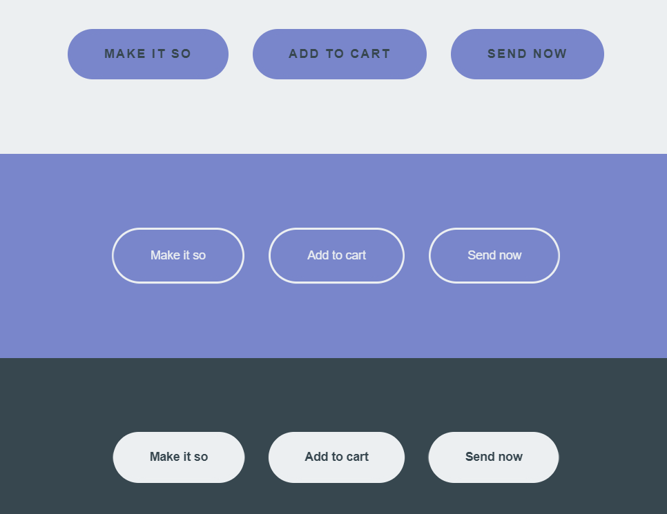

# Onsikgo CSS 리드 파일

## 메인 컬러

* 미정

---

## 보조 컬러

* 미정

---

## 폰트

### * 대표 폰트

* IBM Plex Sans KR

  ```
  font-family: 'IBM Plex Sans KR', sans-serif;
  ```

  

### * 보조 폰트

* Noto Sans Korean

* Gothic A1

  ```
  font-family: 'Noto Sans KR', sans-serif;
  font-family: 'Gothic A1', sans-serif;
  ```

---

## 버튼 스타일 



---

